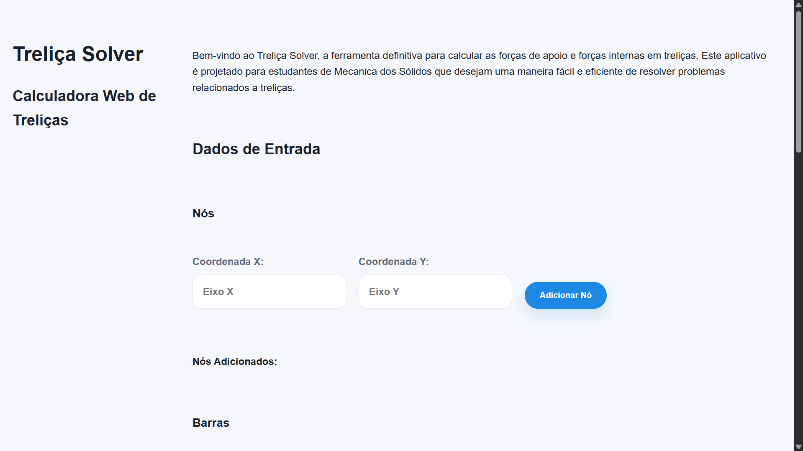
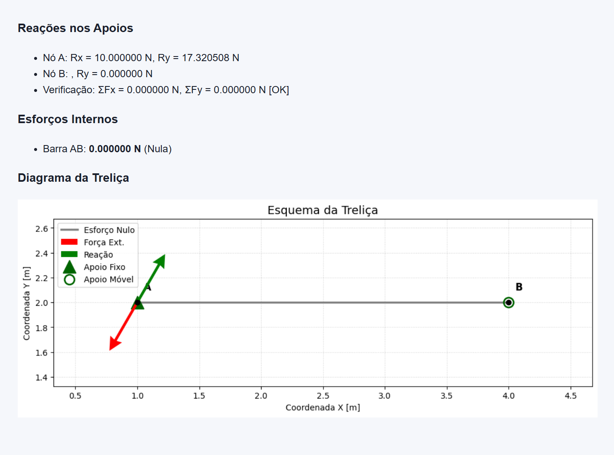

# Treliça Solver

Um aplicativo web para calcular as reações de apoio em treliças isostáticas simples e visualizar o esquema da treliça com forças e reações. Desenvolvido com FastAPI para o backend e HTML/CSS/JavaScript para o frontend, utilizando Matplotlib para a geração dos diagramas.


> Página inicial do programa

## Funcionalidades

- **Entrada de Dados Interativa**: Adicione nós, barras, forças externas e apoios através de formulários no navegador.
- **Cálculo de Reações**: Determina as reações de apoio para treliças isostáticas (1 apoio fixo e 1 apoio móvel).
- **Verificação de Equilíbrio**: Confirma se as equações de equilíbrio são satisfeitas.
- **Visualização Gráfica**: Gera um diagrama vetorial da treliça, mostrando nós, barras, forças aplicadas e reações calculadas.
- **Detecção de Instabilidade**: Alerta sobre configurações de apoio que podem levar à instabilidade.

## Pesquisa de Mercado

A base estratégica e o entendimento das necessidades dos usuários podem ser consultados na nossa [Pesquisa de Mercado](pesquisa_de_mercado.md).

## Fundamentos Teóricos

O Treliça Solver utiliza princípios fundamentais da Mecânica Estática:

1.  **Reações de Apoio**: São calculadas utilizando as três equações de equilíbrio para um corpo rígido no plano:
    *   $\sum F_x = 0$ (Soma das forças horizontais)
    *   $\sum F_y = 0$ (Soma das forças verticais)
    *   $\sum M_z = 0$ (Soma dos momentos em relação a um ponto, geralmente o apoio fixo)

2.  **Esforços Internos (Método dos Nós via Abordagem Matricial)**: 
    Para determinar a força em cada barra, o nosso sistema resolve o equilíbrio de translação em cada nó simultaneamente.
    *   **Formulação**: O problema é montado na forma de um sistema linear $[A]\{f\} = \{b\}$.
        *   $[A]$ (**Matriz de Coeficientes**): Contém os componentes geométricos (cossenos diretores $cos \theta$ e $sen \theta$) de cada barra em relação aos nós.
        *   $\{f\}$ (**Vetor de Incógnitas**): Representa os esforços internos em cada barra.
        *   $\{b\}$ (**Vetor de Cargas**): Contém as forças externas e reações de apoio aplicadas.
    *   **Resolução**: Utilizamos o método de **Mínimos Quadrados Lineares** (`numpy.linalg.lstsq`). Essa escolha permite que o solver lide com sistemas determinados e fornece uma solução estável mesmo se houver pequenas redundâncias numéricas.

3.  **Convenção de Sinais**:
    *   Resultados **positivos** indicam **Tração** (a barra está sendo "esticada").
    *   Resultados **negativos** indicam **Compressão** (a barra está sendo "esmagada").

## Precisão dos Cálculos

Por padrão, o nosso nosso sistema utiliza uma precisão de **6 casas decimais** para todos os arredondamentos e verificações de equilíbrio. Este valor foi escolhido para equilibrar a legibilidade dos resultados com a precisão necessária para engenharia. 
*   **Nota**: Essa precisão pode ser modificada diretamente nas funções de arredondamento dentro do arquivo `solver_core.py`.

## Tecnologias Utilizadas

- **Backend**:
    - **Python**: Linguagem de programação principal.
    - **FastAPI**: Framework web moderno e rápido para construir APIs.
    - **Uvicorn**: Servidor ASGI para rodar aplicações FastAPI.
    - **NumPy**: Para operações numéricas.
    - **Matplotlib**: Para a geração de gráficos e diagramas.
- **Frontend**:
    - **HTML5**: Estrutura da página web.
    - **CSS3**: Estilização da interface.
    - **JavaScript**: Lógica interativa para coleta de dados e comunicação com o backend.

## Como Rodar o Projeto

### Pré-requisitos

- Python 3.X
- `pip` (gerenciador de pacotes do Python)

### Instalação

1.  **Clone o repositório:**
    ```bash
    git clone https://github.com/seu-usuario/trelicas-solver.git
    cd trelicas-solver
    ```
2.  **Crie e ative um ambiente virtual (recomendado):**
    ```bash
    python -m venv venv
    # No Windows
    .\venv\Scripts\activate
    # No macOS/Linux
    source venv/bin/activate
    ```
3.  **Instale as dependências:**
    ```bash
    pip install -r requirements.txt
    ```

### Execução

1.  **Inicie o servidor FastAPI:**
    ```bash
    uvicorn server:app --reload
    ```
    O `--reload` é para desenvolvimento, ou seja, o servidor reiniciará automaticamente a cada mudança no código.

2.  **Acesse a aplicação:**
    Abra seu navegador e vá para `http://127.0.0.1:8000`.

## Uso

1.  **Adicione Nós**: Insira as coordenadas X e Y para cada nó da treliça.
2.  **Adicione Barras**: Conecte os nós existentes para formar as barras da treliça.
3.  **Adicione Forças Externas**: Especifique a magnitude, o ângulo e o nó de aplicação de cada força.
4.  **Adicione Apoios**: Defina o tipo de apoio (Fixo/Pino ou Móvel/Rolete) e o nó onde ele está localizado.
5.  **Calcule**: Clique no botão "Calcular Treliça" para obter as reações de apoio e visualizar o diagrama.

## Exemplos


> Note que a barra constou com esforço nulo, apesar de não ser matematicamente nulo. Isso deve-se ao fato da precisão usada, que é de 6 casas decimais.

## Estrutura do Projeto

```
trelicas-solver/
├── static/main.css       # Estilos CSS para o frontend
├── index.html            # Página HTML principal da aplicação
├── server.py             # Backend FastAPI para servir o site e processar requisições
├── solver_core.py        # Lógica principal de cálculo das reações da treliça
├── solver_ori.py         # Lógica original do resolvedor de treliças (full terminal, sem interação gráfica)
├── visualizer.py         # Lógica para gerar os diagramas da treliça com Matplotlib
├── utils.py              # Funções utilitárias (entrada, interseção, equação da reta, momentos)
├── tests.py              # Casos de teste (atualmente não integrado ao web app, mas útil para o core)
└── README.md             # Este arquivo
```