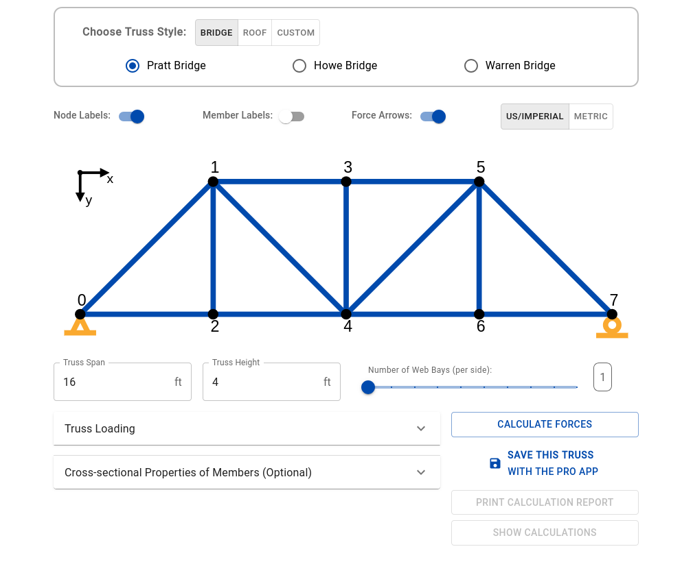
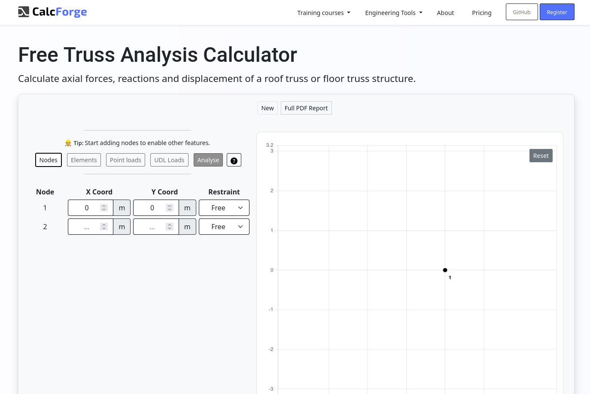
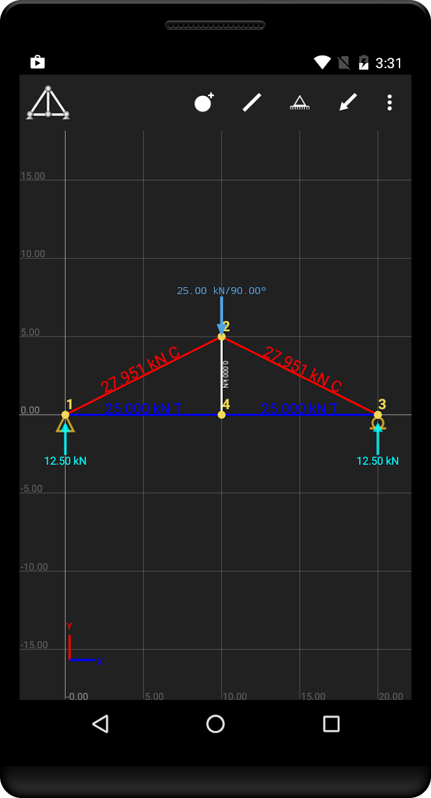

# Pesquisa de Mercado

## 1. Objetivo da Pesquisa
Analisar o cenário atual das ferramentas de análise estrutural de treliças para identificar lacunas nos mercados educacional e profissional, com foco em usabilidade e acessibilidade.

## 2. Público-Alvo
*   **Estudantes de Engenharia:** Necessitam de ferramentas rápidas para validar exercícios de Isostática e Resistência dos Materiais.
*   **Professores:** Buscam ferramentas visuais para demonstrar conceitos de reações de apoio e esforços internos.
*   **Engenheiros Civis/Mecânicos:** Profissionais que precisam de verificações rápidas em campo ou em fases preliminares de projeto.

## 3. Análise de Concorrentes
*   **Ftool (Desktop):** O padrão da indústria acadêmica no Brasil. Muito completo, porém requer instalação e possui interface datada.
*   **[SkyCiv](https://skyciv.com) (Web):** Poderoso e baseado em nuvem, mas focado no mercado corporativo com modelos de assinatura caros.
*   **[TrussAnalysis](https://trussanalysis.com/free) (Web):** Calculadora simples que analisa facilmente uma ampla variedade de estilos comuns de treliças predeterminadas.

*   **[CalcForge](https://calcforge.com/1/free-truss-calculator) (Web):** Outra calculadora web de treliças, simples de usar e com objetivos semelhantes aos nossos.

    
*   **Calculadoras Mobile:** Aplicativos simples que, muitas vezes, carecem de visualizações claras de diagramas e relatórios detalhados.
    * SW Truss: Aplicativo de análise de elementos finitos para a análise de treliças planas estaticamente determinado e indeterminado
    
    

## 4. Tendências e Oportunidades
*   **SaaS (Software as a Service):** Migração total de ferramentas de cálculo para o navegador, eliminando barreiras de instalação.
*   **Visualização Interativa:** Gráficos gerados dinamicamente (como o uso de Matplotlib/Plotly) para facilitar a interpretação de resultados.
*   **Open Source:** Projetos transparentes que permitem auditoria de cálculo por parte da comunidade acadêmica.

## 5. Diferenciais do Treliça Solver
*   Interface leve e minimalista.
*   Foco em treliças isostáticas com visualização instantânea de reações.
*   Totalmente gratuito e acessível via qualquer aparelho com navegador moderno.
*   Cálculos sem restrições artificiais de complexidade (limitados apenas pelas leis da física).